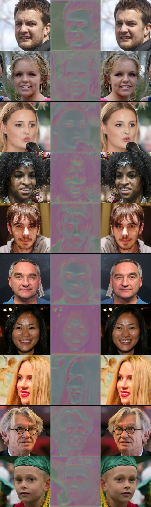
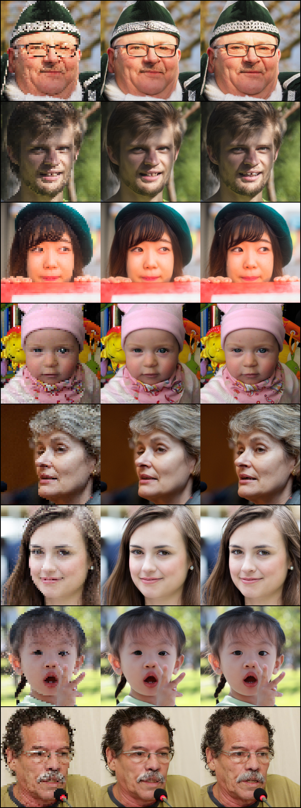

# Face Super Resolution

Face super resolution based on ESRGAN (https://github.com/xinntao/BasicSR)

The primary aim of the Face-Image Super Resolution (SR) is 
to construct the High Resolution (HR) face images from the 
Low Resolution (LR) face images. Existing techniques for 
Super Resolution mostly rely on either the prior facial 
knowledge, prior image degradation information for better 
HR results, but it often led to limited generalization over 
images from different sources. In recent years, state of the 
art techniques for Face Image SR using GANs were 
introduced, which produces promising results. Therefore, 
we thoroughly studied the different GANs-based 
techniques and found HiFaceGAN and ESRGAN approaches. 
We adopt different ideas from these models as baseline 
and implemented our own version with few enhancements 
. To bring novelty and to further enhanced the results, we 
proposed multiple improvements in the architecture of 
ESRGAN. We replaced the standard discriminator loss of 
ESRGAN with PatchGAN discriminator from pix2pix GAN to 
reduce the unrealistic effect of artifacts in the 
reconstructed images and used LPIPS loss on face datasets 
for 4x upscaling factor. With extensive experiments with 
different loss functions to get more realistic images, 
proposed model yields more realistic and enhanced results 
than the original ESRGAN model.
## Folder Structure

The directory structure of the developed project is shown as follows.

```
Getty_Bert_Fine_Tune
│   README.md
│   requirements.txt
│
└───src
│   │   train.py
│   │   gen_lr_imgs.py
│   │   test_on_image.py
│   │   │
│   │   └───datasets
│   │   │   │   datasets.py
│   │   │   │
│   │   └───model
│   │   │   │   RRDBNet_arch.py
│   │   │   │
│   │   └───utills
│   │   │   │   module_util.py
│   │    
└─── Checkpoints
│   │   .
│   │   
└─── Results
│   │   training
│   │   testing
└─── test_images
│   │   .
│   │ 
```

## How to test
The model is trained for the 5 epochs on FFHQ-512, We are doing 4x scaling for that we resize the image 64 and add some
artifacts in the image for lr images and for HR images we resize the image 256.
The model can be tested by the following command in the bash or command line from src folder. You have to upload your 
image in the test_images folder and give path while running the cmd. Results will be generated in the Results/testing.

```
cd src
python test_on_image.py --image_path ../test_images/02220.png
```
## Dataset
Dataset we used for this project is FFHQ-512, which available on the given link.

```
https://www.kaggle.com/arnaud58/flickrfaceshq-dataset-ffhq
```

## Train the model
For training the model first you have to run the gen_lr_imgs.py by defining the path of your dataset images in the file. 
After that run the following command. You have to run it from src folder.

```
python gen_lr_imgs.py
```

For training the model run the following cmd, for training parameters check the help of the training file.

```
python train.py --help
python train.py --HR_images_path ../FFHQ --LR_images_path ../lr_64
```

## Results
Results on the training data, given results are from the beginning in the training. 

INPUT & OUR & GROUND TRUTH



Results after 5 epochs,

INPUT & OUR & GROUND TRUTH

